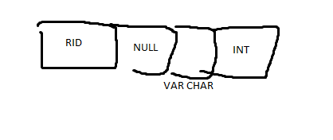

## Project 1 Report

### 1. Basic information
 - Team #: 13
 - Github Repo Link: https://github.com/wjson2002/cs222-winter24-wjson2002
 - Student 1 UCI NetID: wujp1
 - Student 1 Name: Jason Wu

### 2. Internal Record Format

- Show your record format design.

- Describe how you store a null field.
I store the null field at the start of each record. 
I calculate the number of bytes using the formula provided (n = ceil(y / 8)).
To store n number of bytes for null field

- Describe how you store a VarChar field.
VarChar is compressed by the given size of the first byte. I read this byte and allocate enough space for the 
size of the string.

- Describe how your record design satisfies O(1) field access.
To access a field, you can use the record attribute to retrieve the field in O(1) time.

### 3. Page Format
- Show your page format design.

- Explain your slot directory design if applicable.

Records are tracked using a slot directory (SD) that starts at the beginning of the page.
Each SD contains the total free size in page (F), number of records (N), and SD entries that hold a offset and length of record.
Records are then inserted into the page to end of the page which is calculated based on the SD.

### 4. Page Management
- Show your algorithm of finding next available-space page when inserting a record.

loop(Number of Pages) starting last page, which also would be a newly appended page.
- read page into empty buffer
- check if available page size less than record size
- insert into page
- flush to file

if no page found
- add new page and insert to page

###
- How many hidden pages are utilized in your design?

Use 1 hidden page that stores number of pages, read,write,append.

- Show your hidden page(s) format design if applicable
One page of size 4096 is allocated to be the hidden page.
This page stores each variable as a unsigned int at the start of the hidden page.

### 5. Implementation Detail
- Other implementation details goes here.

Slot Directory needs reserved space so that adding records to the page does not overwrite the directory.
Need to find a balance of free space to space allocated for directory. 
Currently uses 200 bytes for slot directory. 
Freespace is 2 bytes, number of elements is 1 byte, max number of slot elements would be (200 - 3) / 8 = 24 records can be store in slot directory
before overwriting into records.

### 6. Member contribution (for team of two)
- Explain how you distribute the workload in team.
Solo work.

### 7. Other (optional)
- Freely use this section to tell us about things that are related to the project 1, but not related to the other sections (optional)

Before the submission deadline:
I Spent a lot of time fixing bugs and unable to pinpoint why write/read records fails in some cases.

After submission deadline (Grace period):
I ended up changing the entire structure of my design by moving the slot directory orginally located at end of page and moved it to the front of the page.
This fixed a lot of buffer issues I was encountering and made design simpler.
Also used CLion debugger to speed up debugging process.

- Feedback on the project to help improve the project. (optional)

Project one is somewhat tough, as I am also very rusty in C++. I feel like only implementing Paged Manager is enough for project one.
Record Manager should be pushed to project two.