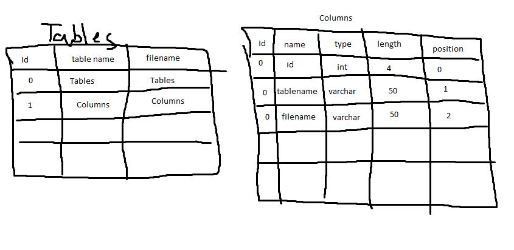
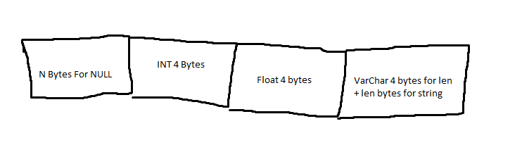
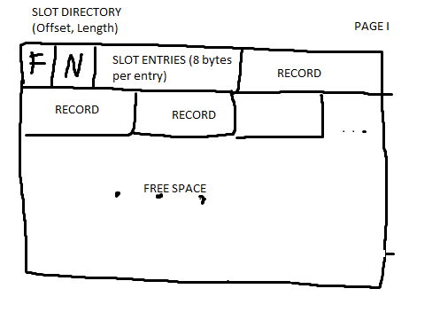

## Project 2 Report

### 1. Basic information
 - Team #: 13
 - Github Repo Link: https://github.com/wjson2002/cs222-winter24-wjson2002/blob/main/report/project2.md
 - Student 1 UCI NetID: wujp1
 - Student 1 Name: Jason Wu
 

### 2. Meta-data
- Show your meta-data design (Tables and Columns table) and information about each column.

Design of tables and columns is similar to ones provided during lectures. 

Tables table store the metadata for each table: id, table name, and filename.
While Columns table store metadata for each attribute for each table: id, name of attribute, type, length, and position.

### 3. Internal Record Format (in case you have changed from P1, please re-enter here)
- Show your record format design.

- Describe how you store a null field.

I store the null field at the start of each record.
I calculate the number of bytes using the formula provided (n = ceil(y / 8)).
Then store n number of bytes for null field. Each

- Describe how you store a VarChar field.

Varchar uses the first 4 bytes to store the length, 

- Describe how your record design satisfies O(1) field access.

To access a field, you can use the record attribute to retrieve the field in O(1) time.

### 4. Page Format (in case you have changed from P1, please re-enter here)
- Show your page format design.

  

- Explain your slot directory design if applicable.

Records are tracked using a slot directory (SD) that starts at the beginning of the page.
Each SD contains the total free size in page (F), number of records (N), and SD entries that hold a offset and length of record.
Records are then inserted into the page to end of the page which is calculated based on the SD.
From Project one I increased the fixed size of the slot directory to 325 bytes. Each slot is 8 bytes, (4) for offset, (4) for length.

### 5. Page Management (in case you have changed from P1, please re-enter here)
- How many hidden pages are utilized in your design?

Use 1 hidden page that stores number of pages, read,write,append.

- Show your hidden page(s) format design if applicable

One page of size 4096 is allocated to be the hidden page.
This page stores each variable as a unsigned int at the start of the hidden page.

### 6. Describe the following operation logic.
- Delete a record
Read page to buffer with given Page Number.
Get Page Information (Free space, number of records) and get record offset and length with given RID.
Check if record is tombstone, if it is then get the RID from offset and call deleteRecord on new RID.
Else delete current record by setting all bytes in record to 0. And remove record from slot directory.
Shift all other records that are stored at larger offsets and adjust their offsets.

- Update a record
Read page to buffer with given Page Number.
Get Page Information (Free space, number of records).
Check for 4 scenarios:
Scenario 1: Updated record is same size as old record:
Write to old record with new data

Scenario 2: Update record is smaller than old:
Write to old record with new data.
Shift all records that have larger offsets to close the gap.
Adjust offsets in slot directory.

Scenario 3: Updated Record Size Greater Old Record Size and no free space left on page:
Create tombstone record of size 6, insert record to new location.
shift all other records with larger offset to close the gap.

Scenario 3: Updated Record Size Greater Old Record Size enough free space:
Shift records with larger offset to the right so enough space is created.
Insert new record data.
Adjust slot record for old record length.

- Scan on normal records
Scan is initialed at RID (0,0). When getNextRecord or getNextTuple is called
it will search through the records until a record matching the condition is found and returns it.
Once the RID passes the number of pages and last slot then it will return EOF.

- Scan on deleted records
Scan will not work on deleted records. Since delete records will have negative offset and length.

- Scan on updated records
Scan will work normally on updated records.

### 7. Implementation Detail
- Other implementation details goes here.

RM scan uses RBFM scan iterator to work.
In Project 2, I use a map data structure to map filenames/tablename to corresponding table id. 

### 8. Member contribution (for team of two)
- Explain how you distribute the workload in team.

Solo work.

### 9. Other (optional)
- Freely use this section to tell us about things that are related to the project 1, but not related to the other sections (optional)

- Feedback on the project to help improve the project. (optional)

Some of the test cases take too long to run.
I would like to see more explanation of function in the project writeup. I would like information on what paramaters are passed in and 
example use cases.

Local test cases and gradescope tests are inconsistent. Sometimes I can pass local tests, but fail gradescope tests.