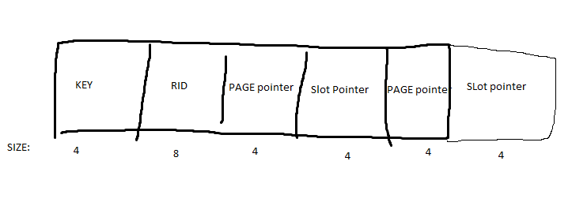
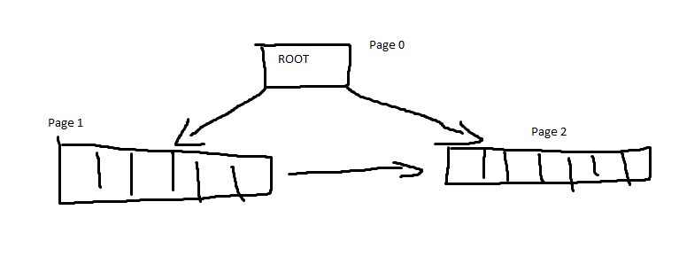
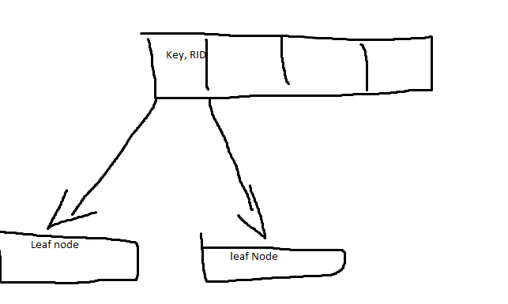
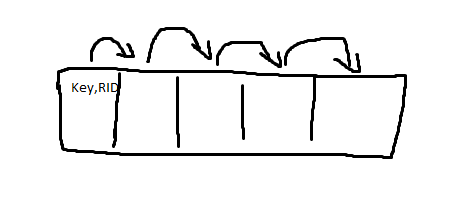

## Project 3 Report

### 1. Basic information
- Team #: 13
- Github Repo Link: https://github.com/wjson2002/cs222-winter24-wjson2002/blob/main/report/project3.md
- Student 1 UCI NetID: wujp1
- Student 1 Name: Jason Wu

### 2. Meta-data page in an index file
- Show your meta-data page of an index design if you have any. 

Each index contains key, RID, and 2 pointers to children indexes.

### 3. Index Entry Format
- Show your index entry design (structure). 

  - entries on internal nodes:  
Entries are inserted to first available space.
  - entries on leaf nodes:
Entries are insert to first available space.

### 4. Page Format
- Show your internal-page (non-leaf node) design.

Each non-leaf node contains a key, RID, and pointers to leaf or non leaf nodes

- Show your leaf-page (leaf node) design.

Each lead node entry contains a key and RID and a pointer to next entry.

### 5. Describe the following operation logic.
- Split
Not implemented.

- Rotation (if applicable)
Not implemented.

- Merge/non-lazy deletion (if applicable)
Not implemented.

- Duplicate key span in a page
Not implemented.

- Duplicate key span multiple pages (if applicable)
Not implemented.

### 6. Implementation Detail
- Have you added your own module or source file (.cc or .h)? 
  Clearly list the changes on files and CMakeLists.txt, if any.
None.

- Other implementation details:
Did not complete B+ tree.

### 7. Member contribution (for team of two)
- Explain how you distribute the workload in team.
Solo work.

### 8. Other (optional)
- Freely use this section to tell us about things that are related to the project 3, but not related to the other sections (optional)

- Feedback on the project to help improve the project. (optional)
I feel burnt out from project 1 & 2, was not able to work as much as I would have liked on project 3. 
Providing B+ tree implementation can lighten the workload and have students just design the structure.