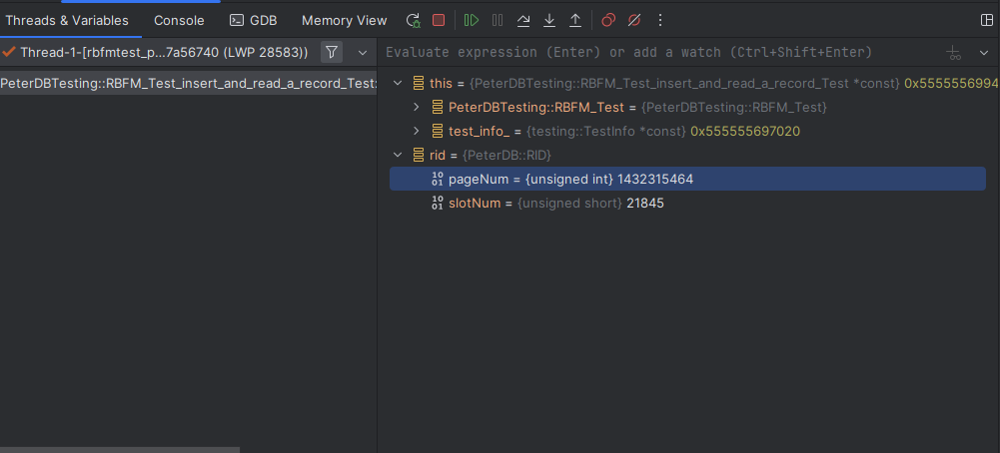
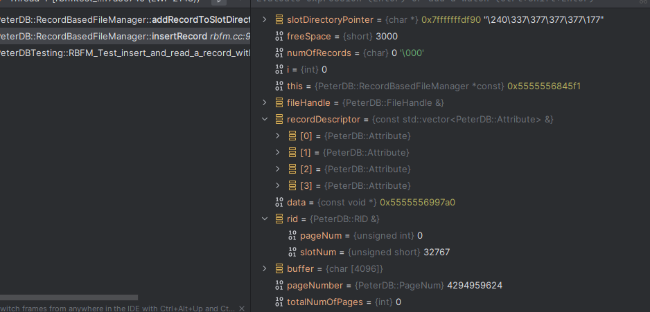
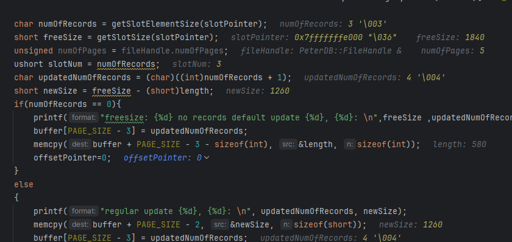
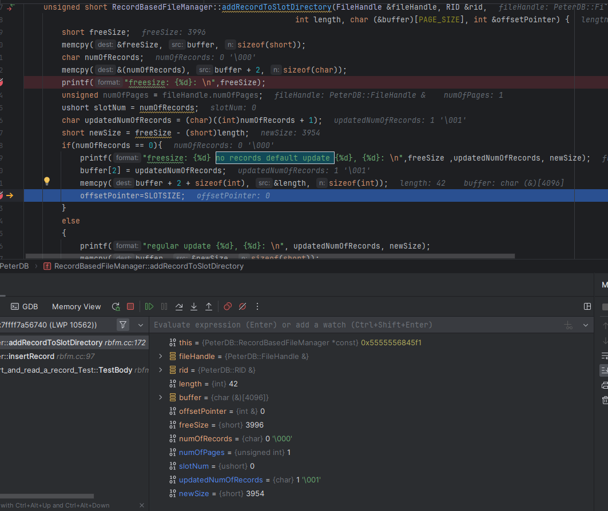
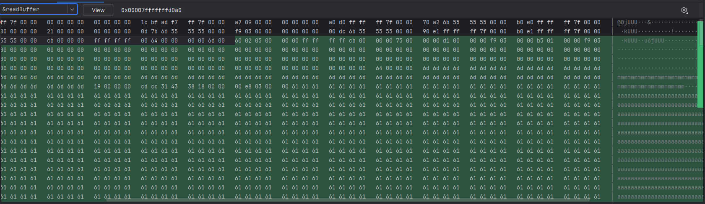
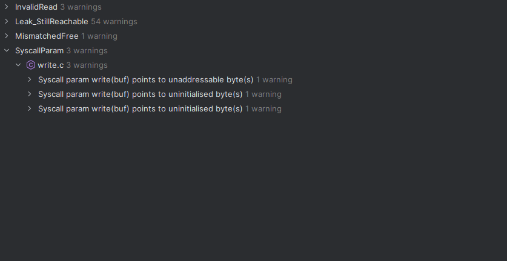
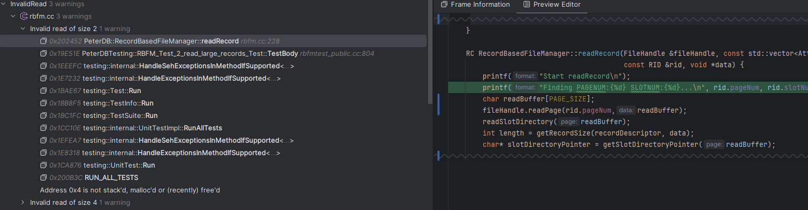

## Debugger and Valgrind Report

### 1. Basic information
 - Team #: 13
 - Github Repo Link: 
 - Student 1 UCI NetID: wujp1
 - Student 1 Name: Jason Wu
 - Student 2 UCI NetID (if applicable):
 - Student 2 Name (if applicable):

### 2. Using a Debugger
- Describe how you use a debugger (gdb, or lldb, or CLion debugger) to debug your code and show screenshots. 
For example, using breakpoints, step in/step out/step over, evaluate expressions, etc. 

Used Clion debugger to check the values of variables such as RID.

Here I am debugging the insertRecord function by stepping into it and viewing the variables.
- I use breakpoints to stop at the function to more carefully inspect it.
- 
Debugger is very helpful for visualizing your code as seen in the image it displays the variable values.
I used this functionality to view the record values I save/write to the page.
- 
Clion debugger shows me which line is seg faulting, which speeds up debugging process.
- 
- Here I check the bytes in my buffer to ensure that my updateRecord and readRecord and properly updating/reading for Project 2.
### 3. Using Valgrind
- Describe how you use Valgrind to detect memory leaks and other problems in your code and show screenshot of the Valgrind report.

I use valgrind to trace errors that are shown.

This image uses that I have a potential read error at line 228. Based on these Valgrind messages I can more efficient find errors.
- 